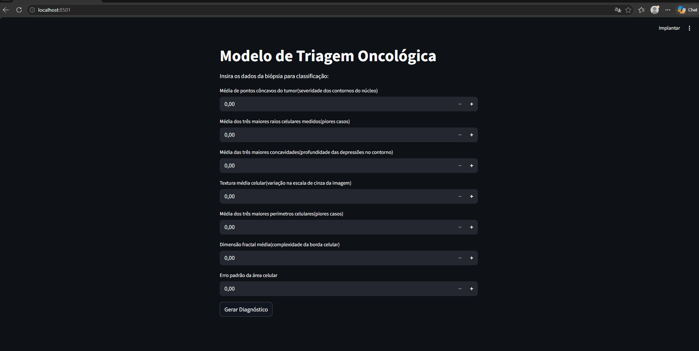

# 🔬 Breast Cancer Classifier: Modelo de Triagem Oncológica


🔗 [Acessar aplicação](https://breastcancerclassificator.streamlit.app/)

Um aplicativo web interativo voltado para a triagem e diagnóstico assistido de câncer de mama. O sistema utiliza um modelo de **Gradient Boosting (XGBoost)** para analisar métricas celulares de biópsias e prever a probabilidade de um tumor ser maligno ou benigno.

## 🎯 O Problema e a Arquitetura da Solução

Em cenários clínicos, a redução de falsos negativos é a métrica mais crítica. O projeto aborda este problema através de uma pipeline de Machine Learning robusta:

*   **Otimização e Feature Selection:** Utilização de `RandomizedSearchCV` e redução de dimensionalidade para mitigar ruídos e focar nas 7 variáveis celulares de maior impacto.
*   **Tratamento de Dados:** Aplicação de **SMOTE** para balanceamento das classes.
*   **Desempenho:** O modelo final alcançou **98% de Acurácia Global**, **AUC de 0.99** na curva ROC e **98% de Recall** para casos malignos.
*   **Engenharia e Qualidade:** O projeto é estruturado de forma modular (desacoplando o pipeline de treinamento em `src/train.py` da aplicação web em `src/app.py`) e inclui testes unitários automatizados para garantir a reprodutibilidade e a integridade matemática da inferência. O notebook original foi mantido para fins de documentação da Análise Exploratória de Dados (EDA).

## 🛠️ Stack Tecnológico
*   **Linguagem:** Python 3.11 (gerenciado via `pyenv`)
*   **Machine Learning:** XGBoost, Scikit-Learn, Imbalanced-learn (SMOTE)
*   **Manipulação de Dados:** Pandas, NumPy
*   **Interface Web:** Streamlit
*   **Engenharia de Software:** Pytest (Testes Unitários), Joblib (Serialização), Pathlib

## 🚀 Como Executar o Projeto Localmente

### 1. Clonar o Repositório e Preparar o Ambiente
```bash
git clone [https://github.com/SEU_USUARIO/nome_do_repositorio.git](https://github.com/SEU_USUARIO/nome_do_repositorio.git)
cd nome_do_repositorio

# Criação e ativação do ambiente virtual
python -m venv .venv
# Windows:
.venv\Scripts\activate
# Linux/macOS:
source .venv/bin/activate
```

### 2. Instalar Dependências
```bash
pip install -r requirements.txt
```

### 3. Executar a Aplicação Web
```bash
streamlit run src/app.py
```
O servidor local iniciará e a interface estará disponível no navegador (padrão: `http://localhost:8501`).

## 🧪 Testes Automatizados (Pytest)
A aplicação conta com uma suíte de testes unitários para validar o carregamento isolado do modelo (`@pytest.fixture`), a integridade dos dados de saída do XGBoost (classes binárias `0` ou `1`) e as restrições matemáticas das probabilidades (limites entre 0 e 1, e soma igual a 100%).

Para executar a validação, utilize o comando na raiz do projeto:
```bash
pytest -v
```

## 📂 Estrutura de Diretórios
```text
├── .venv/                                      # Ambiente virtual Python
├── models/                                     # Diretório para armazenamento dos modelos
├── src/                                        # Código-fonte da aplicação
│   ├── app.py                                  # Script principal da interface web interativa (Streamlit)
│   └── train.py                                # Script modularizado para treinamento do modelo
├── tests/                                      # Suíte de testes automatizados com Pytest
├── .python-version                             # Versão do Python configurada via pyenv
├── Breast_Cancer_Wisconsin_Diagnostic.ipynb    # Notebook de Análise Exploratória (EDA) e prototipação
├── demo.gif                                    # Demonstração visual da aplicação
└── requirements.txt                            # Dependências de ambiente
```
